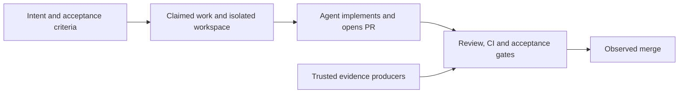

# Graphyard

**Turn a fleet of coding agents into an engineering system.**

Graphyard is an open-source harness for multi-agent software engineering: a shared control plane for coordinating work, isolated worktrees, reviews, tests, and evidence across many agents and machines.

The ambition is to carry work all the way from intent to verified delivery. Writing code is one step. Knowing who owns it, what it depends on, whether the right behavior was tested, and whether the change actually reached users is the larger job.

Herdr is the first integration. Your agent tools run the workers; Graphyard gives their work a durable lifecycle and decides when it has enough proof to advance.

**Available today:** coordination through an evidence-backed GitHub merge. **Next:** staging, E2E execution, production observations, and verification after deployment. This is v0.1, built for supervised dogfooding.

[Get started](docs/quickstart.md) · [Master-agent setup](docs/master-agent.md) · [First enforced PR](docs/first-pr.md) · [Connect Herdr](docs/herdr.md) · [Deploy](docs/deployment.md) · [Architecture](docs/architecture.md)

## More agents should mean more progress

One agent can keep much of its work in context. A fleet cannot rely on a shared memory that does not exist.

Across machines and worktrees, someone needs to answer:

- Who owns this task, and is that worker still alive?
- Is its dependency finished, or is it building against an assumption?
- Which branch belongs to this attempt? Can a previous worker still submit?
- Did the required tests run against the current candidate?
- Was the acceptance criterion demonstrated, or did someone just report “done”?
- What is blocked, why, and what evidence would unblock it?

Graphyard records these facts in one durable ledger and applies explicit rules to them. Agents can claim work, write code, and submit results. Progression belongs to the control plane.

## How work moves



The current delivery graph is:

```text
Backlog → Ready → Build → Review → Test → Acceptance → Merge → Done
```

Every card appears at its first refusing gate. The board makes the next missing step visible; the ledger preserves what happened.

For example, “send a confirmation SMS after booking” might require proof that confirmation sends one message, an unconfirmed booking sends none, and retries do not send duplicates. A green unit-test check alone does not satisfy all three. The work needs the specified, trusted evidence for the current candidate.

`graphyard complete` means the worker has submitted its implementation. It does not move a card to Done. In v0.1, Done means Graphyard observed a merge with satisfied gates and a prior recorded authorization. Production verification is a later milestone.

## What the harness does today

| Capability | What it gives you |
| --- | --- |
| **One work ledger** | Intent, dependencies, acceptance criteria, blockers, ownership, and append-only history. |
| **Durable ownership** | Atomic claims across server replicas, expiring leases, and assignment epochs that reject stale worker commands. |
| **Worktree coordination** | Host/path registration, globally reserved branches, and CLI-created local worktrees. Old attempts stay visible. |
| **Evidence-backed gates** | Proof bound to head commit, base commit, and policy revision. Stale evidence stays auditable without satisfying the current candidate. |
| **GitHub enforcement** | Independent PR, review, CI, and merge observation; an App-owned required merge check when branch protection is configured. |
| **A live delivery view** | Delivery graph and Kanban board with ownership, gate refusals, evidence, integration errors, and history. |
| **Versioned E2E definitions** | Scenario purpose, steps, expected outcomes, environment, and links to executable tests. Work pins the required scenario revision. |
| **Validation runner protocol** | Immutable candidates, approved test bundles, separate runner/collector identities, explicit ACKs, fenced attempts and recovery. External execution remains a separate integration. |
| **Recovery between steps** | Durable reconciliation jobs, deduplicated webhooks, retry-safe commands, and periodic reconciliation. |
| **Herdr integration** | A native plugin to inspect work and manage claims, with CLI supervision for worker processes. |
| **Recommended master agent** | One visible coordinator joins Graphyard work truth with Herdr health, routes individually authenticated workers, and performs exact-candidate routine merges. |

A test-case definition is a requirement, not a passing test. Executable tests stay in Git; runners execute them; Graphyard records and evaluates their evidence. Large artifacts stay in CI or object storage. See the [test-case registry](docs/test-cases.md) and [validation protocol](docs/validation.md).

## Bring your agents

Graphyard owns workflow truth. Git owns source truth. GitHub supplies PR and merge facts. Agent runtimes own their sessions. Trusted runners supply evidence.

Use the native [Herdr plugin](docs/herdr.md), or integrate an external worker through the [CLI and HTTP API](docs/protocol.md). Workers can use Claude Code, Codex, OpenCode, other runtimes, or human-operated tools without moving ownership into those runtimes. Herdr is the first packaged integration; other runtimes use the common protocol.

Run one shared Graphyard server. Point workers on each machine at it with individual credentials and stable host IDs. Worktrees stay on worker machines; the control plane does not need their filesystems mounted or SSH access.

For several concurrent agents, use the [recommended master-agent operating mode](docs/master-agent.md). It observes existing authenticated Herdr sessions and dispatches new work through supervised Codex, Claude, or other launch profiles. The master observes and routes; worker-scoped launchers claim immediately before starting the agent, and Graphyard remains authoritative.

```sh
graphyard master init --url https://YOUR-GRAPHYARD-HOST --token-stdin
graphyard master start codex
graphyard master status
```

Initialization preserves your repository instructions, keeps coordinator configuration local and ignored, and leaves existing worker connections intact.

## Run it locally

Requires Node 24, Git, and Docker Compose.

```sh
git clone https://github.com/cryptob1/graphyard.git
cd graphyard
npm ci
cp .env.example .env
# Replace example credentials in .env with distinct random secrets.
docker compose up -d db
npm run build
npm start
```

Open `http://localhost:4310` and sign in with your individual access token. The [quickstart](docs/quickstart.md) walks through creating work, claiming an assignment, creating its worktree, supervising a worker, and submitting a PR.

For repository discovery, agent instructions, GitHub App setup, and a real refusal-to-acceptance loop, follow [Your first enforced PR](docs/first-pr.md). GitHub merge gates remain closed until the integration and protection are configured.

The package is not published to npm yet. Use `npm run cli -- ...` or `node /path/to/graphyard/bin/graphyard.mjs ...` from a checkout.

## Self-host it

One application container and Postgres. The application serves the web UI and API and runs reconciliation; Postgres holds durable coordination state.

Use [Railway or Docker Compose](docs/deployment.md). The repository includes a Dockerfile. Railway infrastructure configuration describes this project's deployment and needs adaptation for a new installation. No Helm chart ships yet.

Graphyard does not require LangGraph, Temporal, Redis, or Kubernetes. Its current workload uses Postgres transactions and durable retries. See [why the engine works this way](docs/architecture.md#why-no-workflow-framework-yet).

## Where we are going

The full engineering lifecycle extends beyond merge. The next capabilities follow that path:

- **Deployed behavior:** model environments and deployed versions, request E2E runs, and verify the candidate that is actually running.
- **Safer parallel work:** build on advisory file-overlap warnings and declared-resource reservations to investigate API and semantic conflicts beyond branch isolation.
- **Easier first value:** improve repository discovery, proof selection, and the first real PR flowing through gates.
- **Evolving requirements:** build on operator-only audited revisions with finer-grained evidence applicability.
- **Broader delivery:** extend toward configurable graphs, release and rollback workflows, and multiple repositories.

These are directions, not features available in v0.1. The current control plane supports one GitHub repository and one protected base branch, with multiple workers, machines, and worktrees. Fleet-scale throughput and recovery need measured validation before claiming support for hundreds of concurrent agents.

A lease fences Graphyard commands; it cannot revoke filesystem access or Git credentials. GitHub checks are eventually consistent with the ledger, and completed checks do not expire when Graphyard is offline. The [enforcement boundary](docs/github.md#enforcement-boundary) explains these limits.

## Documentation

| You want to… | Read |
| --- | --- |
| Run locally and complete your first task | [Quickstart](docs/quickstart.md) |
| Connect the first enforced PR | [Guided onboarding and acceptance](docs/first-pr.md) |
| Understand decisions, evidence, and recovery | [Architecture](docs/architecture.md) |
| Deploy, upgrade, or back up Graphyard | [Deployment](docs/deployment.md) |
| Configure required GitHub gates | [GitHub enforcement](docs/github.md) |
| Integrate workers and trusted producers | [Agent protocol and API](docs/protocol.md) |
| Define and version E2E scenarios | [Test-case registry](docs/test-cases.md) |
| Use Graphyard inside Herdr | [Herdr plugin](docs/herdr.md) |
| Coordinate a fleet with one master agent | [Master-agent operating mode](docs/master-agent.md) |
| Diagnose blocked or abandoned work | [Operations](docs/operations.md) |
| Build Graphyard with Graphyard | [Development and dogfooding](docs/development.md) |
| Inspect current coverage against the spec | [Implementation audit](docs/implementation-audit.md) |

## Contribute

Start with the [development guide](docs/development.md) and [AGENTS.md](AGENTS.md). Changes to coordination need evidence too.

```sh
npm run build
npm test
```

Tests start a real, isolated Postgres instance and exercise concurrent claims, lease expiry, stale evidence, producer identity, workspace reservations, durable jobs, history, and the API boundary. They require local socket access and a non-root account.

Graphyard is licensed under [Apache 2.0](LICENSE).

Read the [turnkey E2E and verified delivery roadmap](docs/turnkey-delivery-roadmap.md) for the planned runner integrations, deployment verification, recovery and self-hosted setup path. It distinguishes shipped behavior from the work still required.
