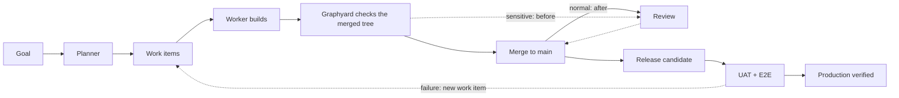

# Graphyard

Graphyard is a control plane that runs a team of AI coding agents on a repository. Its goal is software that ships itself: agents build, verify, review and release, while the human keeps three decisions, namely goals and priorities, spending money or opening accounts, and issuing credentials to people.

## Start here: setup and docs

Set up with one command, then read the [setup checklist](docs/setup-from-zero.md):

```sh
graphyard up --agent --goal GOAL.md
```

[Install](docs/install.md) · [How Graphyard works](docs/how-graphyard-works.md) · [Onboard a repository](docs/onboarding.md) · [Documentation](docs/README.md)

**[docs/install.md](docs/install.md) is the primary install path** (`install --provider railway|hetzner|compose`). Contribute via [AGENTS.md](AGENTS.md) and [development](docs/development.md). Licence: [Apache 2.0](LICENSE).

## How it works

1. You give Graphyard a goal, written in plain language in a file.
2. A planner agent turns the goal into small work items, each with acceptance criteria that say what finished means.
3. A worker agent then takes over: the worker builds each work item on its own branch and opens a pull request.
4. Graphyard checks the merged tree, the change combined with the latest main, by building it and running its tests, and then performs the merge to main itself.
5. An independent agent performs a review, before the merge for sensitive changes such as authentication, stored data and deployment, and after the merge for everything else.
6. About every ten merges Graphyard cuts a release candidate and deploys it to a test environment for UAT + E2E, meaning user acceptance checks plus the end-to-end test suite.
7. A passing candidate is promoted to production and checked there, so each release ends with production verified.
8. A failure anywhere is reverted or fixed forward by a new work item, which travels the same path.

Only Graphyard writes to main: people and agents open pull requests, and Graphyard merges the ones that pass every check.


```mermaid
flowchart LR
  A[Goal] --> B[Planner] --> C[Work items] --> D[Worker builds] --> E[Graphyard checks the merged tree]
  E --> F[Merge to main] -->|normal: after| G[Review]
  E -.->|sensitive: before| G -.-> F
  F --> H[Release candidate] --> I[UAT + E2E] --> J[Production verified]
  I -.->|failure: new work item| C
```

Text equivalent: a goal goes to the planner, which writes work items; a worker builds each one; Graphyard checks the merged tree and merges to main; a review happens before the merge for sensitive changes and after it for the rest; every ten or so merges a release candidate runs UAT + E2E, and a passing one is promoted and production verified; a failure comes back as a new work item.
