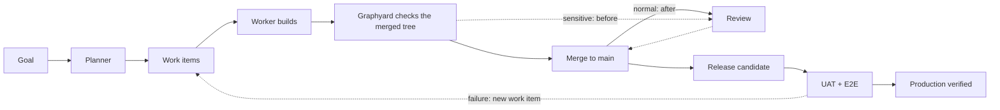

# Graphyard

Graphyard is a control plane that runs a team of AI coding agents on a repository. Its goal is software that ships itself: agents build, verify, review and release, while the human keeps three decisions: goals and priorities, spending money or opening accounts, and issuing credentials to people.

## Start here: setup and docs

Set up with one command, then read the [setup checklist](docs/setup-from-zero.md):

```sh
graphyard up --agent --goal GOAL.md
```

[Install](docs/install.md) · [How Graphyard works](docs/how-graphyard-works.md) · [Onboard a repository](docs/onboarding.md) · [Documentation](docs/README.md)

**[docs/install.md](docs/install.md) is the primary install path** (`install --provider railway|hetzner|compose`). Contribute via [AGENTS.md](AGENTS.md) and [development](docs/development.md). Licence: [Apache 2.0](LICENSE).

## How it works

1. You give Graphyard a goal in a plain-language file.
2. A planner agent turns the goal into small work items, each with acceptance criteria.
3. A worker agent takes over: the worker builds each work item on its own branch.
4. Graphyard checks the merged tree, the change on latest main, with build and tests, then does the merge to main itself.
5. An independent agent reviews, before the merge for sensitive changes like authentication, and after the merge for everything else.
6. About every ten merges a release candidate goes to a test environment for UAT + E2E, user acceptance plus the end-to-end suite.
7. A passing candidate is promoted to production and checked there: production verified.
8. A failure anywhere is reverted or fixed forward by a new work item.

Only Graphyard writes to main, merging pull requests that pass every check.


```mermaid
flowchart LR
  A[Goal] --> B[Planner] --> C[Work items] --> D[Worker builds] --> E[Graphyard checks the merged tree]
  E --> F[Merge to main] -->|normal: after| G[Review]
  E -.->|sensitive: before| G -.-> F
  F --> H[Release candidate] --> I[UAT + E2E] --> J[Production verified]
  I -.->|failure: new work item| C
```

Text equivalent: the numbered steps above.
