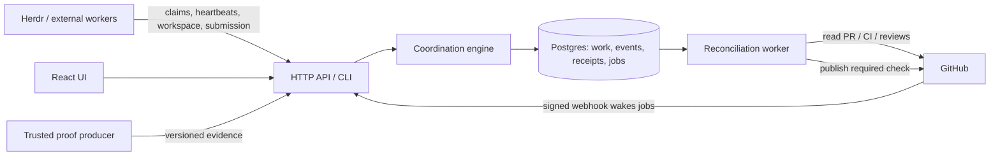

# Architecture and correctness model

## Boundary

Graphyard owns coordination decisions. Git owns source history. GitHub owns the actual PR and merge facts. Herdr owns agent sessions. Test runners produce evidence. A Graphyard gate is a deterministic evaluation, never an LLM judgment.

## Storage

`work_items.document` is the current aggregate: intent, requirements, assignment, workspaces, candidate, evidence, gates, and observed facts. Each mutation updates that aggregate and appends an event containing its new snapshot in the same transaction. `events.seq` provides ledger order; wall-clock timestamps alone do not define ordering.

`receipts` stores the result of each successful command under `(principal, idempotency key)` plus a fingerprint of the command. Retries return the original result. A key reused for different input refuses. Read fresh status after replaying an old claim response; an idempotent replay is not a renewed lease.

`jobs` is a durable integration queue, with next-attempt time, owner token, lease expiry, error, and attempt count. It is created transactionally with PR submission. Jobs are processed with Postgres `FOR UPDATE SKIP LOCKED`, then acknowledged with the exact owner token. GitHub calls occur outside coordination transactions.

Database triggers reject updates and deletes to the event ledger. This is an application audit guarantee, not tamper-proof storage against a database administrator. Backups and database access controls still matter.

## Coordination transactions

All short domain mutations acquire one Postgres transaction advisory lock. This deliberately serializes cross-item decisions, including dependency readiness and workspace reservations, across API replicas. Remote calls never hold that lock. The first implementation chooses an easily audited concurrency model; measure contention before replacing it with finer-grained locking.

Work requirements and dependency edges are fixed at creation, and dependencies must already exist. This construction prevents dependency cycles. A future policy-edit command must add explicit revisions and invalidate affected evaluations atomically; editing JSON directly is unsupported.

## Assignments and workspaces

A claim succeeds only for released, unblocked work with finished dependencies and no active lease. Time comes from Postgres. Every claim increments an epoch. Heartbeat, release, blocker, workspace, and submission commands require the current owner, epoch, and an unexpired lease.

Lease expiration makes an unsubmitted task recoverable. Old workspaces remain reserved and visible. A new attempt receives a fresh branch and path; Graphyard never silently deletes another attempt's files. A workspace location is `(host ID, absolute path)`. Set `GRAPHYARD_HOST_ID` when hostnames are not globally unique. A branch is reserved globally within the managed repository.

The CLI reserves before creating a worktree. A failed filesystem operation leaves a visible reservation. It is not compensated by destructive cleanup. This is an intentionally safe partial failure requiring local inspection.

## Candidates and evidence

A candidate is `(PR, head SHA, base SHA)`, independently read from GitHub and checked against the assigned branch. Gates evaluate the candidate together with immutable policy revision 1 and the criterion definitions. A push or base change invalidates matching requirements automatically because old evidence no longer matches the tuple.

Evidence carries producer identity derived from authentication. A worker cannot self-assign trust. A producer credential has an allowlist of exact proof names. Operators may attest `manual:` proofs, but cannot use an operator token to mint trusted automated test evidence. Latest submitted trusted evidence for each matching proof/candidate/policy wins, including a later failure. Historical and stale evidence remains visible.

CI check success proves that named check reported success. It does not prove test inventory. Acceptance evidence separately requires counts and named behavioral proofs. A trusted producer is responsible for deriving these counts from actual reports and binding them to the actual tested code. Graphyard cannot determine whether an assertion adequately expresses product intent.

## Reconciliation

The server runs a non-overlapping tick every two seconds. It expires leases and reevaluates affected state, then processes up to four available GitHub jobs concurrently. A successful job becomes eligible again after 20 seconds; a failed job after 45 seconds. These timings are MVP defaults, not latency guarantees under a large backlog. Add replicas or adjust batching after measuring real load.

Signed webhooks deduplicate delivery IDs and wake jobs. Their payload is a notification, not trusted workflow truth: the worker refetches GitHub data. Periodic polling catches missed webhooks. Observation application compares the work revision read before external I/O to the current revision; concurrent changes force a retry.

Applying an observation also requires the integration job's unexpired owner token. Check publication rechecks that token, the current work revision, and observation freshness after provider reads and immediately before writing. The adapter rereads the PR after collecting evidence and refuses a changed head, base, draft, or open/closed state. These checks narrow races; they do not make the provider write atomic with Postgres.

Each job wake increments a generation. If evidence or a webhook arrives during a running job, acknowledgment preserves an immediate retry instead of overwriting the wake with the normal polling delay. Expired owners cannot acknowledge jobs. Authorized completed work removes its polling job.

GitHub observations older than two minutes refuse the merge gate. Actual GitHub check revocation is asynchronous and cannot be guaranteed during outages. See the [external enforcement boundary](github.md#enforcement-boundary).

## Display state and history

The graph shows the first refusing stage; the card contains all refusal reasons. A blocker annotates work without introducing a separate lifecycle node. Delivered work stays historically delivered. A merge observed with unsatisfied gates creates a permanent visible violation and does not become done when missing evidence arrives later.

The board is a view of evaluated state. There is no drag-to-done API. Current dwell metrics measure how long items have been in their present stage; they are not historical throughput percentiles.

Before a merge can complete work, Graphyard must have recorded an authorization for the same head, base, and policy. The engine consults ledger snapshots at the reported merge time, so an outage or later failure does not erase historical authorization. The delivery record references the authorization revision and observed merge SHA. Later differing checks remain visible as a follow-up warning.

Evidence received after an earlier merge cannot retroactively invent approval. Authorization must predate the earliest possible merge instant; changes within the provider timestamp's precision window are considered conservatively. GitHub's whole-second timestamps can cause same-second authorizations to be refused. This assumes reasonably synchronized provider/database clocks and cannot establish subsecond ordering or prove the merged artifact was tested; a restricted merge broker and artifact verification remain necessary for a stronger guarantee.

## Why no workflow framework yet?

LangGraph would be appropriate inside an agent runtime; Graphyard is runtime-independent. Temporal could eventually run long-lived deployment/rollback activities. The MVP has a small set of short database commands and repeatable external observations. Postgres transactions and durable retries cover that workload while keeping deployment to two services. Domain invariants remain Graphyard's responsibility whichever execution mechanism is used.
