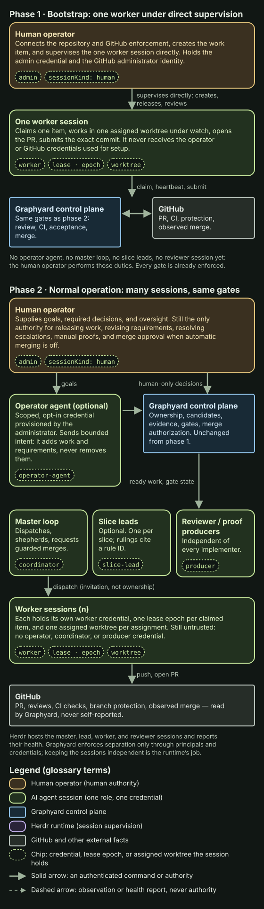
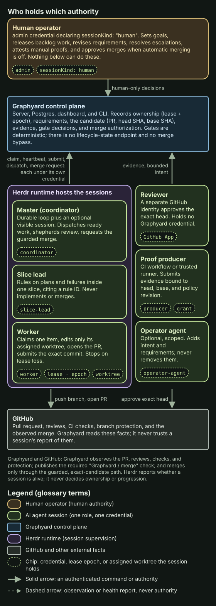
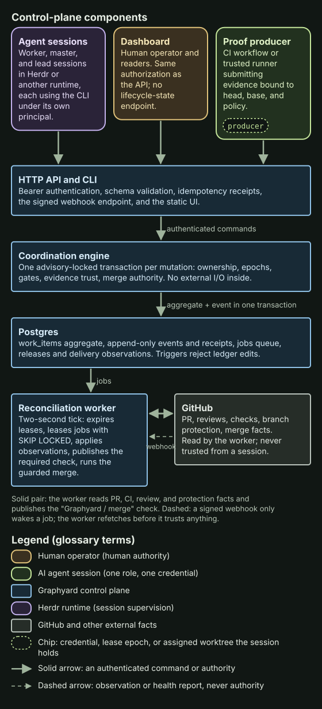

<!-- page: Start here | 1 | lifecycle and authority. -->
# How Graphyard works

Graphyard decides whether work may advance; runtimes such as Herdr run the sessions doing it ([glossary](glossary.md)).

## One trip from setup to Done

1. **Ready**: an item with criteria naming proofs is released and unblocked.
2. **Build**: a worker claims a lease and worktree, and submits a PR.
3. **Review**: an independent reviewer approves the exact commit.
4. **Test**: Graphyard observes CI itself.
5. **Acceptance**: granted producers report evidence for that commit.
6. **Done**: Graphyard rechecks every gate, merges, and observes the merge.

A card stops at its first refusing gate, naming what is missing; nothing sets a stage directly.

Text equivalent: in bootstrap the human operator supervises one worker while gates are activated; normally the master dispatches to many workers, each with its own credential and worktree, and reviewers and producers judge candidates under the same gates.

## Who holds which authority

Text equivalent: the human operator sends human-only decisions to Graphyard; Herdr hosts the master (`coordinator`), slice lead and worker (epoch, worktree); the reviewer is a GitHub identity and the producer holds a grant. Each session commands Graphyard under its own credential; merges go only through the guarded path. Colours follow the [legend](glossary.md#diagram-legend).

## Correctness rules

Text equivalent: sessions, the dashboard and producers call the API; the engine applies each mutation in one locked Postgres transaction, appending an event; the reconciliation worker syncs GitHub, publishes the required check and runs the guarded merge; the webhook only wakes a job.

- Gates are deterministic checks of one candidate, `(PR, head SHA, base SHA)`, under the current policy revision; a push or base change invalidates old evidence.
- Every claim increments the epoch; commands from an old epoch or an expired lease are refused.
- Evidence is attributed to its authenticated producer; the latest trusted record per proof and candidate wins, even a failure.
- History is append-only, and a retried command replays its original result.
- Graphyard merges only the exact authorized candidate, once; any other merge is a permanent violation. Merge is not [delivery](delivery.md).
