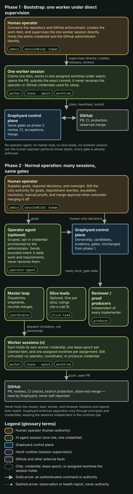
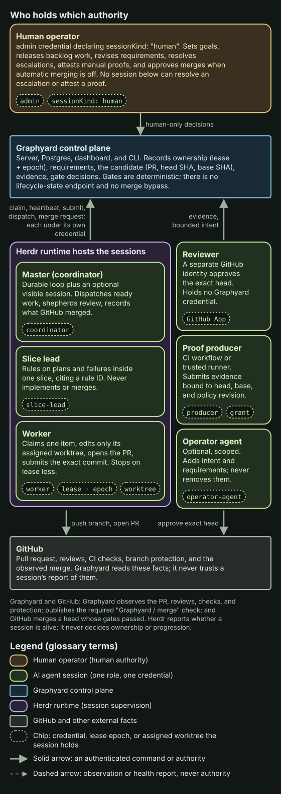
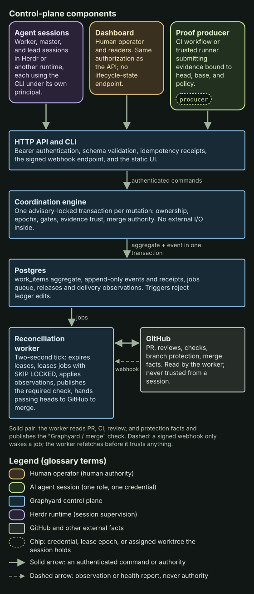

<!-- page: Start here | 1 | lifecycle and authority. -->
# How Graphyard works

Graphyard decides whether work may advance; runtimes such as Herdr run the sessions ([glossary](glossary.md)).

## One trip from setup to Done

1. **Ready**: an item whose criteria name proofs is released and unblocked.
2. **Build**: a worker claims a lease and worktree, and submits a PR.
3. **Review**: an independent reviewer approves the exact commit.
4. **Test**: Graphyard observes CI itself.
5. **Acceptance**: granted producers report evidence for that commit — the criteria's proofs its lane requires (see [risk lanes](#risk-lanes)).
6. **Done**: Graphyard rechecks every gate, merges, and observes the merge.

A card stops at its first refusing gate, naming what is missing; nothing sets a stage directly.

## Shared project memory

Every worker, reviewer and producer Graphyard launches starts with a project-memory digest for its role in its first request, within 500 words:
- Approved decisions with the approver's reason, and operator answers that provided what was asked.
- Recurring fault classes with their sanctioned remedies.
- Merges to main after the session's base, with their files (the last 24 hours when the base is not a remembered merge).

An entry that would overrun the budget is skipped, not the end of its section: later, shorter entries are still added. An oversized decision is cut to the words that fit and marked `…`; it is shown when it is the first decision or at least five words remain.

The loop updates it only from decisions it sees applied (never a refusal), answered human requests, recurring fault classes and merges — never from an agent's claim — and keeps it in its cursor and `.graphyard/project-memory.json`. `graphyard master status` reports it as `projectMemory`, and the Workers page shows it.

## Risk lanes

Every item rides a **risk lane**, decided from the paths its change touches by the shipped path policy (`src/model/policy.ts`) and stamped on the item with its speed target in `master status`: any path under `migrations/schema`, `auth/credentials`, the schema and persistence layer (`src/store/`), authentication, principals, the public API, its assembler and the credential-loading bootstrap under `src/server/`, the operator agent, proof grants, or the installation and deployment surfaces (`src/install/`, `deploy/`, the Dockerfile, `compose.yaml`) rides **high**; test-only, docs-only and single-module changes (paths sharing their leading segments) ride **low**, and everything else rides **medium**. A rename is classified from both endpoints. The lane is an input to the one landability verdict (`src/model/gates.ts`): it takes the item's lane, decides from it which facts it requires, and reports the lane with its speed target.

- **Low** lands on its required CI checks and one approving review: the producer-run proofs and `manual:` attestations its criteria name are not required, no producer is dispatched for them, and its reworks are applied without an approver decision — a bad low-risk change is caught and reverted, not prevented.
- **Medium** adds its producer-run proofs (`unit:`, `integration:`); its reworks need no approver either.
- **High** keeps the full path: producer proofs, `manual:` attestations, and a two-party approver decision for every rework.

An `e2e:` proof and an inherited bootstrap obligation are required in every lane, and a change not yet observed rides high. A rework needing no approver is recorded in the decision ledger as approved by `graphyard-risk-lane`. Speed targets ship per lane — low p50 30 min, medium 60 min, high 4 h — and are reported beside it.

Text equivalent: in bootstrap the human operator supervises one worker while gates are activated; normally the master dispatches to many workers, each with its own credential and worktree, while reviewers and producers judge candidates under the same gates.

## Who holds which authority

Text equivalent: the human operator sends human-only decisions to Graphyard; Herdr hosts the master (`coordinator`), slice lead and worker (epoch, worktree); the reviewer is a GitHub identity and the producer holds a grant. Each session commands Graphyard under its own credential; merges go only through the guarded path. Colours follow the [legend](glossary.md#diagram-legend).

## Correctness rules

Text equivalent: sessions, the dashboard and producers call the API; the engine applies each mutation in one locked Postgres transaction, appending an event; the reconciliation worker syncs GitHub, publishes the required check and runs the guarded merge; the webhook only wakes a job.

- Gates are deterministic checks of one candidate, `(PR, head SHA, base SHA)`, under the current policy revision; a push or base change invalidates old evidence.
- Every claim increments the epoch; commands from an old epoch or expired lease are refused.
- Evidence is attributed to its authenticated producer; the latest trusted record per proof and candidate wins, even a failure.
- History is append-only (routine rows are compacted after a retention window), and a command retried within a day replays its original result.
- Graphyard merges only the exact authorized candidate, once; any other merge is a permanent violation. Merge is not [delivery](delivery.md).
