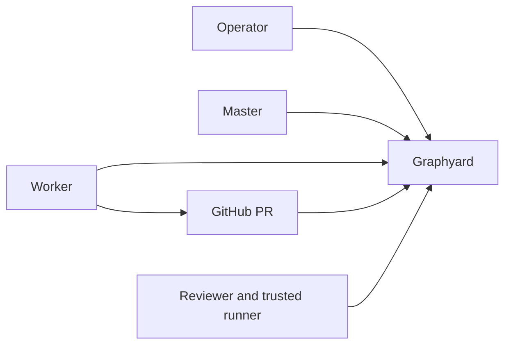

# Onboard a repository

This is the supported path from an existing GitHub repository to Graphyard, Herdr, one master, and one worker. Start with one worker; add capacity after the first PR reaches Done.



## Before you start

You need Node 24, Git, Docker, Herdr 0.7.1+, a Graphyard checkout, a GitHub repository, and a Railway account or another Docker host. Agent providers such as Codex or Claude must already be authenticated on the machine that runs them. The coordinator also needs GitHub CLI authenticated as an identity allowed to merge the protected base branch.

Graphyard is not published to npm yet. In the commands below:

```sh
export GRAPHYARD_CLI=/absolute/path/to/graphyard/bin/graphyard.mjs
```

For every `--token-stdin` prompt, paste the token, press Enter, then press Ctrl-D to send EOF.

## 1. Deploy one control plane

Use one Graphyard server and one Postgres database for all workers. Follow [deployment](deployment.md) for Railway or Docker Compose.

Create separate credentials for these roles:

| Role | Use |
| --- | --- |
| `admin` | Setup, work creation, requirements, and recovery |
| `coordinator` | Master status and guarded merge authority |
| `worker` | One identity per concurrent implementation session |
| `reader` | Read-only dashboards |
| `producer` | Only the proof names that runner may submit |

Set `GRAPHYARD_PRINCIPALS`, `GITHUB_REPOSITORY`, `GITHUB_BASE_BRANCH`, and `GITHUB_CI_APP_IDS` on the server. Never give an implementation worker an admin, coordinator, or producer token.

Open the Graphyard URL and sign in with the admin token.

## 2. Connect GitHub

From the repository being managed:

```sh
cd /path/to/your-repository
node "$GRAPHYARD_CLI" github-setup https://YOUR-GRAPHYARD-HOST
```

This guided flow supports personal-account Apps. For organization-owned repositories, create the App manually using [GitHub enforcement](github.md#create-and-install-the-app).

Install the App only on the managed repository and copy its private values into the Graphyard service. Configure normal CI and review protection now. The new `Graphyard / merge` check may appear only after the first linked PR; require it as soon as Graphyard publishes it, before merging.

Confirm the exact CI check names and their GitHub App IDs. GitHub Actions uses App ID `15368`; other CI providers do not.

## 3. Connect a worker and Herdr

On a worker machine, from a worker-only checkout:

```sh
cd /path/to/your-repository
node "$GRAPHYARD_CLI" init \
  --url https://YOUR-GRAPHYARD-HOST \
  --herdr \
  --host-id UNIQUE_MACHINE_NAME \
  --token-stdin
```

Supply that worker's token on standard input. Setup:

- verifies the repository and worker identity;
- updates one managed section in `AGENTS.md`;
- adds the `.graphyard/` ignore rule;
- stores the private connection locally;
- links and enables the Herdr plugin.

Commit `AGENTS.md` and `.gitignore`. Never commit `.graphyard/`. Repeat on each worker machine with a different worker identity and host ID.

## 4. Start the master

Use a clean checkout under a dedicated coordinator OS identity or machine. It must not contain a worker connection or expose its merge-capable GitHub CLI credentials to implementation agents.

```sh
cd /path/to/coordinator-checkout
herdr workspace list
node "$GRAPHYARD_CLI" master init \
  --url https://YOUR-GRAPHYARD-HOST \
  --herdr-workspace HERDR_WORKSPACE_ID \
  --token-stdin
node "$GRAPHYARD_CLI" master start codex
```

Supply the coordinator token. Use `master start claude` if preferred. Commit the managed `AGENTS.md` update.

The master reads Graphyard truth, watches runtime health, routes work, and requests guarded merges. It does not implement work or submit evidence.

## 5. Add workers

For a trusted worker on the coordinator host, start from a template:

- [Codex](../examples/master/codex-worker.json)
- [Claude](../examples/master/claude-worker.json)
- [existing Herdr session](../examples/master/existing-worker.json)

Store each worker token in a mode-0600 file outside the repository, edit the template, then:

```sh
node "$GRAPHYARD_CLI" master worker add /path/to/profile.json
node "$GRAPHYARD_CLI" master status
```

Local launch profiles share the coordinator host. They require Linux with a working systemd user manager for durable containment. Use them only for trusted dogfooding or inside a real OS/container boundary that hides coordinator GitHub credentials. On macOS or a Linux host without user systemd, use the remote-worker flow below.

For the recommended separated setup, workers run on other machines with GitHub identities that can push branches and open PRs but cannot merge the protected base branch. Version 0.1 does not remotely launch supervised Herdr tabs across hosts; the master selects work and the remote worker claims it.

## 6. Prove the first PR

Create a small real work item in the UI. Use the repository's exact CI check names and acceptance proofs.

A trusted local profile can be dispatched with:

```sh
node "$GRAPHYARD_CLI" master dispatch GY-1 codex-primary
```

A remote worker uses Herdr or the CLI:

```sh
git fetch origin YOUR_BASE_BRANCH
node "$GRAPHYARD_CLI" claim GY-1
node "$GRAPHYARD_CLI" worktree GY-1 EPOCH origin/YOUR_BASE_BRANCH
cd .graphyard/worktrees/GY-1-EPOCH
node "$GRAPHYARD_CLI" watch GY-1 EPOCH -- YOUR_AGENT_COMMAND
```

The worker pushes the assigned branch, opens a PR, and runs `node "$GRAPHYARD_CLI" complete GY-1 EPOCH PR_NUMBER`. Graphyard waits for current-head review, CI, and trusted acceptance evidence.

Connect that evidence before merging. Version 0.1 has no general-purpose runner: put a narrowly scoped `producer` token in protected CI that pull-request code cannot read, then submit the current candidate's actual result. For a criterion explicitly defined with a `manual:` proof, an admin may inspect it and run `node "$GRAPHYARD_CLI" evidence GY-1 evidence.json`. An admin cannot certify automated proof names. See [evidence submission](protocol.md#evidence).

When `Graphyard / merge` first appears, add it to strict branch protection. After every gate passes:

```sh
node "$GRAPHYARD_CLI" master merge GY-1
```

Done means Graphyard observed that authorized merge. It does not yet mean deployed or production-verified.

Before adding more workers, stop one worker, let its lease expire, reclaim with another identity, and confirm the old epoch can no longer heartbeat or submit.

## Current manual steps

Version 0.1 still requires an operator to deploy the server, provision identities, configure GitHub protection, authenticate agent providers, and connect project-specific trusted evidence. A hosted signup flow and general turnkey E2E execution are not shipped.

Use the [documentation index](README.md) for deeper setup, operations, and protocol details.
