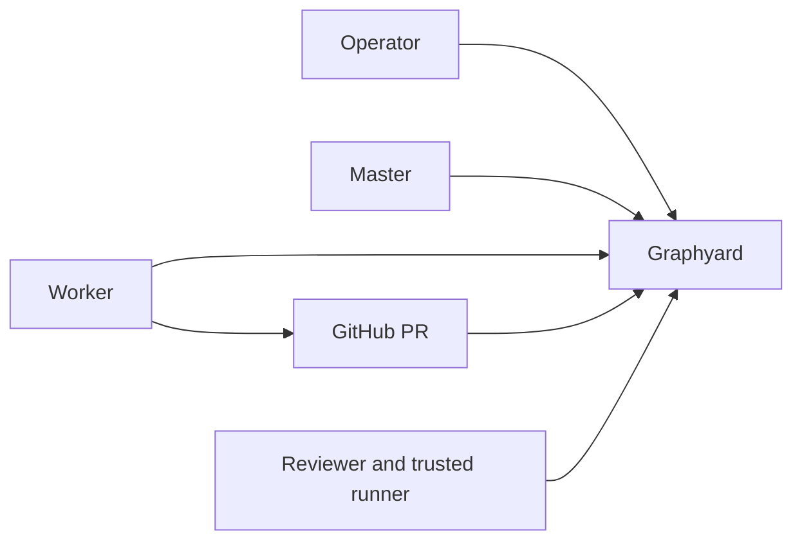

# Onboard a repository

This is the supported path from an existing GitHub repository to a working fleet. One
command installs the control plane — see [install](install.md) for the full runbook — and
this guide covers what surrounds it: the human prompts, adding machines, starting the
master, and proving the first pull request. Start with one worker; add capacity after the
first PR reaches Done.



You keep talking directly to the master. The master reads work and gate state from Graphyard, dispatches ready items to supervised workers, notices stalls, and performs routine exact-candidate merges when every configured gate passes. Workers write code in Graphyard-assigned worktrees. GitHub owns code review and CI facts; trusted runners produce acceptance evidence.

The initial setup works with one worker. Add more workers or machines only after the first PR has completed the full loop.

## Before you start

You need Node 24, Git, a Graphyard checkout, a GitHub repository you administer, and access
to one supported provider. The GitHub CLI must be authenticated as an identity that
administers the base branch. Agent providers such as Codex or Claude must already be signed
in on the machine that runs them; Herdr 0.7.1+ is optional and is bound automatically when
it is installed.

Graphyard is not published to npm yet. In the commands below:

```sh
export GRAPHYARD_CLI=/absolute/path/to/graphyard/bin/graphyard.mjs
```

## 1. Install the control plane

One command replaces the former sequence of deploying a server, generating a token per role,
setting eleven variables, creating a domain, running the GitHub App flow, configuring the
webhook and branch protection, discovering CI App IDs, connecting a worker, and initializing
the master.

```sh
cd /path/to/your-repository
node "$GRAPHYARD_CLI" install --provider railway --repo OWNER/REPO --workers 1 --plan
node "$GRAPHYARD_CLI" install --provider railway --repo OWNER/REPO --workers 1 --apply
```

Follow [install](install.md) for the full runbook: preconditions, per-step verification, and
failure handling. Providers are `railway`, `hetzner`, `docker-host`, and `compose`.

You are prompted for exactly four things:

| Prompt | What to do |
| --- | --- |
| Which provider | Already answered by `--provider` |
| Provider login | Run the login command the installer prints, once |
| The GitHub App confirmation | Open the printed page, confirm the App, install it on this repository |
| Plan approval | Read the plan, then rerun with `--apply` |

The installer generates one credential per role, stores each under
`~/.config/graphyard/<install>/` with mode `0600`, and never prints one. Add
`--producer-proof NAME` for each proof a CI runner may submit; without it no producer
principal is created, which is the safe default. Add `--reviewer NAME` to also register a
separate reviewer GitHub App for [agent review](github.md#identity-bound-agent-review-providers).

Do not create an operator-agent credential during this bootstrap. After the repository is
connected and its gates have completed the protected loop, a human administrator may
optionally configure [scoped operator automation](operator-automation.md). That mode keeps
Operator, Master, Worker, and Reviewer/proof-producer as four distinct AI sessions; it does
not replace human goals, approvals, exceptions, or oversight.

## 2. Read the summary

`--apply` ends with a redacted summary. Confirm `health`, `status.role`, `status.repository`,
`webhook.delivered`, `protection`, and the registered profiles, then work through its
`nextSteps`. Those steps are generated from what actually happened, so they are the
authoritative list of anything still missing — commonly a rerun once Graphyard has published
`Graphyard / merge` on the first pull request.

Open the Graphyard URL and sign in with the admin credential named in the summary.

## 3. Add machines and capacity

The installer configures this machine: the repository connection, the Herdr plugin when
Herdr is present, the master profile, and one worker profile per `--workers`.

For another worker machine, rerun the installer there with a higher `--workers` count, or
connect that machine alone against the existing control plane:

```sh
cd /path/to/your-repository
node "$GRAPHYARD_CLI" init \
  --url https://YOUR-GRAPHYARD-HOST \
  --herdr \
  --host-id UNIQUE_MACHINE_NAME \
  --token-stdin
```

Supply that machine's own worker token on standard input; paste it, press Enter, then
Ctrl-D. Setup verifies the repository and worker identity, updates one managed section in
`AGENTS.md`, adds the `.graphyard/` ignore rule, stores the private connection locally, and
links and enables the Herdr plugin. Commit `AGENTS.md` and `.gitignore`. Never commit
`.graphyard/`. Give every concurrent session a different worker identity and host ID.

Worker profile templates, for a profile added by hand:

- [Codex](../examples/master/codex-worker.json)
- [Claude](../examples/master/claude-worker.json)
- [existing Herdr session](../examples/master/existing-worker.json)

```sh
node "$GRAPHYARD_CLI" master worker add /path/to/profile.json
node "$GRAPHYARD_CLI" master status
```

Local launch profiles share the coordinator host. They require Linux with a working systemd
user manager for durable containment. Use them only for trusted dogfooding or inside a real
OS or container boundary that hides coordinator GitHub credentials. On macOS, or a Linux host
without user systemd, run workers on other machines with GitHub identities that can push
branches and open pull requests but cannot merge the protected base branch. Version 0.1 does
not remotely launch supervised Herdr tabs across hosts; the master selects work and the
remote worker claims it.

## 4. Start the master

```sh
node "$GRAPHYARD_CLI" master start codex
```

Use the agent kind reported as `profiles.master.kind` in the summary. The master reads
Graphyard truth, watches runtime health, routes work, and requests guarded merges. It does
not implement work or submit evidence. Run it from a checkout under a dedicated coordinator
OS identity that does not expose its merge-capable GitHub CLI credentials to implementation
agents.

## 5. Prove the first PR

Create a small real work item in the UI. Use the repository's exact CI check names and acceptance proofs.

A trusted local profile can be dispatched with:

```sh
node "$GRAPHYARD_CLI" master dispatch GY-1 codex-primary
```

A remote worker uses Herdr or the CLI:

```sh
git fetch origin YOUR_BASE_BRANCH
node "$GRAPHYARD_CLI" claim GY-1
node "$GRAPHYARD_CLI" worktree GY-1 EPOCH origin/YOUR_BASE_BRANCH
cd .graphyard/worktrees/GY-1-EPOCH
node "$GRAPHYARD_CLI" watch GY-1 EPOCH -- YOUR_AGENT_COMMAND
```

The worker pushes the assigned branch, opens a PR, and runs `node "$GRAPHYARD_CLI" complete GY-1 EPOCH PR_NUMBER`. Graphyard waits for current-head review, CI, and trusted acceptance evidence.

Connect that evidence before merging. Version 0.1 has no general-purpose runner: put a narrowly scoped `producer` token in protected CI that pull-request code cannot read, then submit the current candidate's actual result. For a criterion explicitly defined with a `manual:` proof, use a separate admin-authenticated operator session to inspect and submit it; never expose that credential to the worker checkout. An admin cannot certify automated proof names. See [evidence submission](protocol.md#evidence).

When `Graphyard / merge` first appears, add it to strict branch protection. After every gate passes:

```sh
node "$GRAPHYARD_CLI" master merge GY-1
```

Done means Graphyard observed that authorized merge. It does not yet mean deployed or production-verified.

Before adding more workers, stop one worker, let its lease expire, reclaim with another identity, and confirm the old epoch can no longer heartbeat or submit.

## What is still manual

The installer covers deployment, identities, GitHub integration, protection, profiles, and
verification. A person still authenticates the provider CLI, the GitHub CLI, and each agent
runtime, confirms the GitHub App in the browser, approves the plan, and connects
project-specific trusted evidence by granting a producer its proof names. A hosted signup
flow and general turnkey E2E execution are not shipped.

Use the [documentation index](README.md) for deeper setup, operations, and protocol details.
