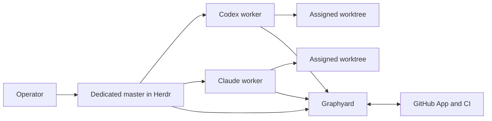

# Onboard a repository to Graphyard and Herdr

This is the recommended first-run path for a GitHub repository. At the end, the repository has one shared Graphyard control plane, GitHub enforcement, repository instructions, a visible Herdr master, and one or more separately authenticated workers.

Graphyard does not require the master or workers to use one model vendor. The examples use Codex and Claude because Herdr can launch both. Graphyard remains the source of ownership and gate truth.

## The finished setup



You keep talking directly to the master. The master reads work and gate state from Graphyard, dispatches ready items to supervised workers, notices stalls, and performs routine exact-candidate merges when every configured gate passes. Workers write code in Graphyard-assigned worktrees. GitHub owns code review and CI facts; trusted runners produce acceptance evidence.

The initial setup works with one worker. Add more workers or machines only after the first PR has completed the full loop.

For the recommended security boundary, run the master and its merge-capable GitHub CLI login on a dedicated coordination machine or OS identity. Run implementation agents under separate OS identities or on worker machines, using GitHub identities that can push feature branches and open PRs but cannot merge the protected base branch. A Graphyard worker token prevents control-plane actions; it cannot hide files or GitHub credentials from another process running as the same OS user.

The short version is:

| Step | Operator action | Result |
| --- | --- | --- |
| 1 | Deploy Graphyard and Postgres | One shared ledger and dashboard |
| 2 | Create separate operator, coordinator, worker, reader, and producer identities | Authority remains separated |
| 3 | Register the GitHub App and protect the base branch | Graphyard can enforce merge decisions |
| 4 | Run `graphyard init --herdr` in the target repository | `AGENTS.md`, private worker connection, and Herdr plugin |
| 5 | Run `graphyard master init`, then `master start` | One visible dedicated coordinator |
| 6 | Add one launch profile per worker | Supervised Codex, Claude, or other capacity |
| 7 | Send a small work item through every gate | The installation is demonstrated, not merely configured |

## Before you start

You need:

- a GitHub repository with an `origin` remote, a base branch, and permission to protect it;
- Node.js 24, Git, Docker, and a local checkout of Graphyard;
- Herdr 0.7.1 or newer on each machine that will run the master or workers;
- Codex, Claude, or another desired agent already authenticated through its own normal login;
- a Railway account for the recommended hosted installation, or a machine that can run Docker Compose;
- GitHub CLI authentication on the machine that will perform guarded merges.

Graphyard Cloud and a public npm package do not exist yet. There is no hosted sign-up screen. Today an operator deploys the open-source server and creates role-scoped credentials. The rest of this guide uses the shipped commands and does not assume planned automation.

Set a convenient local launcher path:

```sh
export GRAPHYARD_CLI=/absolute/path/to/graphyard/bin/graphyard.mjs
```

## 1. Start one shared control plane

For a team that needs access from several machines, Railway is the recommended current path. Clone Graphyard, create a Railway project with an application service and Postgres, and deploy the root `Dockerfile`:

```sh
cd /absolute/path/to/graphyard
npm ci
npx @railway/cli init --name graphyard --workspace YOUR_WORKSPACE_ID
npx @railway/cli add --database postgres
npx @railway/cli add --service graphyard
npx @railway/cli variable set --service graphyard \
  'DATABASE_URL=${{Postgres.DATABASE_URL}}' HOST=0.0.0.0 PORT=4310
```

Before deploying, set `GRAPHYARD_PRINCIPALS`, `GITHUB_REPOSITORY`, and `GITHUB_BASE_BRANCH` in Railway. Graphyard refuses to start without at least one valid principal. Generate a different random token for every entry. A small starting team looks like this; substitute generated values in Railway rather than committing this example:

```json
[
  {"id":"operator","role":"admin","token":"replace-with-generated-admin-secret"},
  {"id":"repo-master","role":"coordinator","token":"replace-with-generated-coordinator-secret"},
  {"id":"codex-1","role":"worker","displayName":"Cedar","runtime":"Codex","token":"replace-with-generated-codex-worker-secret"},
  {"id":"claude-1","role":"worker","displayName":"Juniper","runtime":"Claude","token":"replace-with-generated-claude-worker-secret"},
  {"id":"project-acceptance","role":"producer","proofs":["integration:project-smoke"],"token":"replace-with-generated-producer-secret"},
  {"id":"dashboard","role":"reader","token":"replace-with-generated-reader-secret"}
]
```

Replace `integration:project-smoke` with a real proof produced by protected code in the target project. Create one worker principal per concurrent agent. Never give a worker the operator, coordinator, or trusted-producer token. Store every value in a password manager. The [deployment guide](deployment.md) covers local Docker Compose, Railway variables, upgrades, backups, and the limits of the checked-in Railway configuration.

The checked-in `.railway/railway.ts` describes Graphyard's own installation. Adapt its project and source identities before using it for a new installation. Its environment map uses omit-means-delete semantics, so preserve every private or externally configured variable that must survive apply, including `GITHUB_BASE_BRANCH: preserve()` when the managed branch is not `main`. Then preview every infrastructure change:

```sh
npx @railway/cli config plan
npx @railway/cli config apply
npx @railway/cli up --service graphyard --detach
npx @railway/cli domain --service graphyard --port 4310
```

Read the plan before applying it. Do not run the unmodified project-specific configuration against a new Railway project.

Open the Railway domain and sign in with the operator token for setup and first-work creation. Use the reader token later for dashboards that must not mutate work. Keep the operator token out of agent environments.

## 2. Connect Graphyard to GitHub

For a repository in your personal GitHub account, start the guided App registration from a trusted operator checkout:

```sh
cd /path/to/your-repository
node "$GRAPHYARD_CLI" github-setup https://YOUR-GRAPHYARD-HOST
```

Open the printed local URL, register the App, and install it only on the repository being managed. If the command runs over SSH, forward port 4311 from your browser machine. Copy the resulting App values into the Graphyard service's private Railway variables and redeploy.

For an organization-owned repository, the guided command's personal-account registration endpoint is not suitable. Create the private App under the organization, install it only on the managed repository, and configure its credentials manually by following [GitHub enforcement](github.md#github-app). Do not move App private keys through the repository or agent sessions.

Configure the base branch's normal CI and selected review policy now. The new App-owned `Graphyard / merge` check may not appear in GitHub's protection selector until Graphyard has published it on the first linked PR. If it is available, require it with strict up-to-date branches and enforced administration. Otherwise finish that rule during step 6 immediately after the first failing check appears and before any merge. Until protection is complete, Graphyard can coordinate work but must keep merge gates closed.

Graphyard also binds CI evidence to trusted GitHub App IDs. Inspect a representative commit's check runs before the first work item:

```sh
gh api repos/OWNER/REPOSITORY/commits/COMMIT_SHA/check-runs \
  --jq '.check_runs[] | [.name, .app.id, .app.name] | @tsv'
```

Set `GITHUB_CI_APP_IDS` on the Graphyard service to the comma-separated App IDs that are allowed to supply required CI checks, and preserve that variable in Railway IaC. GitHub Actions uses App ID `15368`; do not assume that default for another CI provider.

Choose the review source deliberately. Native GitHub approval requires an eligible reviewer on the current head. Codex review requires the Codex GitHub integration to be installed and the work policy to select `reviewProvider: "codex"`; Graphyard requests and verifies that result, but does not impersonate the reviewer or run Codex itself.

Acceptance needs its own identity boundary. Add a `producer` principal whose `proofs` list contains only the proof names that runner may submit, store that token in a protected CI environment, and keep it unavailable to pull-request code. A general-purpose automatic runner is not shipped in version 0.1. Graphyard's protected acceptance workflow is a working example for this repository, while a new project must connect its own runner or use operator-submitted manual evidence for an explicitly manual criterion. See [test cases](test-cases.md) and [validation](validation.md).

## 3. Install repository instructions and the Herdr plugin

From the repository you are onboarding, use the first worker's credential:

```sh
cd /path/to/your-repository
node "$GRAPHYARD_CLI" init \
  --url https://YOUR-GRAPHYARD-HOST \
  --herdr \
  --host-id THIS_MACHINE_NAME \
  --token-stdin
```

Paste or pipe the `worker` token and send EOF. The command verifies the server and repository, discovers scripts and workflows, installs one managed section in `AGENTS.md`, stores the worker connection under ignored `.graphyard/`, and links and enables the native Herdr plugin. Existing `AGENTS.md` instructions are preserved.

Review and commit the managed `AGENTS.md` update and the generated `.gitignore` rule for `.graphyard/`. Never commit the `.graphyard/` directory itself. Run this step on every worker machine with a unique host ID and that worker's own token.

## 4. Install the dedicated master

On the coordinator machine, still inside the managed repository:

```sh
node "$GRAPHYARD_CLI" master init \
  --url https://YOUR-GRAPHYARD-HOST \
  --token-stdin
```

Paste the `coordinator` token and send EOF. This adds the managed master instructions to `AGENTS.md`, validates the repository binding, and stores the coordinator credential outside the repository. Commit the resulting `AGENTS.md` update.

Start the visible master in Herdr:

```sh
node "$GRAPHYARD_CLI" master start codex
# Or use: master start claude
```

This creates a dedicated, non-focused Herdr tab and prompts the master to read Graphyard's operating guide and current status. It does not claim implementation work.

## 5. Add the worker cluster

For each launchable worker, put only that worker's Graphyard token in a local mode-0600 file outside the repository and every linked worktree. Run this block in Bash so the prompt can disable terminal echo:

```bash
mkdir -p ~/.config/graphyard/workers
chmod 700 ~/.config/graphyard ~/.config/graphyard/workers
umask 077
IFS= read -r -s -p 'Worker token: ' GRAPHYARD_WORKER_CREDENTIAL
printf '\n'
printf '%s' "$GRAPHYARD_WORKER_CREDENTIAL" > ~/.config/graphyard/workers/codex-1.token
unset GRAPHYARD_WORKER_CREDENTIAL
chmod 600 ~/.config/graphyard/workers/codex-1.token
```

The token is read without terminal echo and does not enter shell history.

Copy and edit a profile template:

- [Codex launch profile](../examples/master/codex-worker.json)
- [Claude launch profile](../examples/master/claude-worker.json)
- [existing Herdr session](../examples/master/existing-worker.json)

Then register it:

```sh
node "$GRAPHYARD_CLI" master worker add /path/to/codex-worker.json
node "$GRAPHYARD_CLI" master status
```

Use a launch profile for new assignments. It lets the master claim immediately before launch, create the Graphyard-assigned worktree, start the agent under lease supervision, and clean up failed launches. An existing-session profile provides health visibility for work that session already owns; Graphyard will not inject new work into an unsupervised process.

Launch profiles run on the master's machine: the master reads the credential file locally, creates a local worktree, and opens a local Herdr tab. Use them only for trusted local dogfooding or inside an isolation boundary that prevents the implementation process from reading the coordinator's GitHub credentials. Same-user file permissions do not provide that boundary. Repeat this profile step for each trusted agent account that will run on that host. Provider login and Graphyard identity remain separate. Never reuse a worker token for concurrent sessions.

For the recommended separated setup, run step 3 on each worker machine with its own Graphyard worker identity, host ID, provider login, and non-merge GitHub identity. That worker claims work through the Herdr ledger or Graphyard CLI, creates or registers its worktree on that machine, and runs under `graphyard watch`. The master can join an `existing` profile to a locally visible session's health after it already owns work, but version 0.1 does not remotely dispatch a supervised launch profile across Herdr hosts. Cross-machine assignment therefore requires an operator or remote worker to act on the master's routing decision. See [Herdr on many machines](herdr.md#many-machines).

## 6. Take the first PR through the graph

Create one small, real work item in the Graphyard UI. Before saving it, compare `.graphyard/project.json` with the check-run names on a real GitHub PR and replace the form defaults with the repository's exact required CI check names. Discovery proposes checks; it does not silently rewrite work policy, and `test` or `typecheck` will never pass if the repository publishes different names. Write acceptance criteria before releasing the item, and name the proof each criterion requires. Start with one worker and one independent review source.

For a trusted local launch profile, the master can dispatch directly:

```sh
node "$GRAPHYARD_CLI" master status
node "$GRAPHYARD_CLI" master dispatch GY-1 codex-primary
```

For the recommended separated topology, the master uses `master status` to select the ready item and asks the chosen remote worker to claim it. On that worker machine, use the Herdr ledger or:

```sh
node "$GRAPHYARD_CLI" claim GY-1
node "$GRAPHYARD_CLI" worktree GY-1 EPOCH origin/YOUR_CONFIGURED_BASE_BRANCH
cd .graphyard/worktrees/GY-1-EPOCH
node "$GRAPHYARD_CLI" watch GY-1 EPOCH -- YOUR_AGENT_COMMAND
```

Use the returned epoch. The worker receives a fresh worktree, implements the change, pushes the assigned branch, opens a PR, and runs `graphyard complete`. Graphyard then waits for current-head review, required CI checks, and trusted acceptance evidence. A worker's statement that it is done does not satisfy those gates.

On a fresh GitHub installation, wait for Graphyard to publish the failing `Graphyard / merge` check on this PR. Return to the base branch protection settings, require that App-owned check with strict up-to-date branches and enforced administration, and confirm Graphyard observes the protection. Do this before attempting the first merge.

When every gate passes, the master can perform the supported guarded merge:

```sh
node "$GRAPHYARD_CLI" master merge GY-1
```

With the default master configuration, routine merges are permitted after all gates pass. Use `master init --no-auto-merge` if an operator must approve each merge command. Graphyard marks the work Done only after independently observing the authorized merge.

The [first enforced PR guide](first-pr.md) explains trusted acceptance setup and the refusal-to-acceptance test in detail.

## 7. Prove recovery before adding capacity

Before treating the setup as a fleet, demonstrate these behaviors with two worker identities:

1. two workers race for one task and exactly one claim succeeds;
2. stopping the winning worker lets its lease expire;
3. a replacement receives a higher epoch and a fresh workspace;
4. the stopped worker's stale heartbeat and submission are refused;
5. stale evidence does not satisfy a changed candidate;
6. review, CI, acceptance, guarded merge, and observed completion all appear in the delivery graph.

Only then add more workers and machines. The number of Herdr sessions is capacity; Graphyard's ledger remains authority.

## What setup still makes you do manually

The desired product experience is one guided command that creates the server, identities, GitHub App, master, workers, and first verification item. Version 0.1 has the underlying pieces, but these steps still require operator work:

- deploying the open-source server and Postgres;
- generating and installing role-scoped credentials;
- registering an organization-owned GitHub App and applying branch protection;
- authenticating each agent provider locally;
- choosing acceptance proofs and configuring trusted producers;
- creating worker profile files;
- dispatching the protected acceptance workflow for the first PR.

These are onboarding gaps, not tasks the user should have to understand forever. The safe automation target is a setup wizard that performs them while preserving separate identities and showing every external change before applying it. It must not solve convenience by sharing an operator token, putting secrets in Git, or letting workers define their own proof.

## Where to go next

- [Quickstart](quickstart.md) explains individual work and CLI commands.
- [Master-agent operating mode](master-agent.md) defines routing, recovery, and guarded merges.
- [Herdr integration](herdr.md) covers plugin behavior and multiple machines.
- [GitHub enforcement](github.md) defines the merge boundary.
- [Deployment](deployment.md) covers Railway, Docker Compose, backups, and upgrades.
- [Test cases](test-cases.md) and [validation](validation.md) explain acceptance definitions and runner identities.
