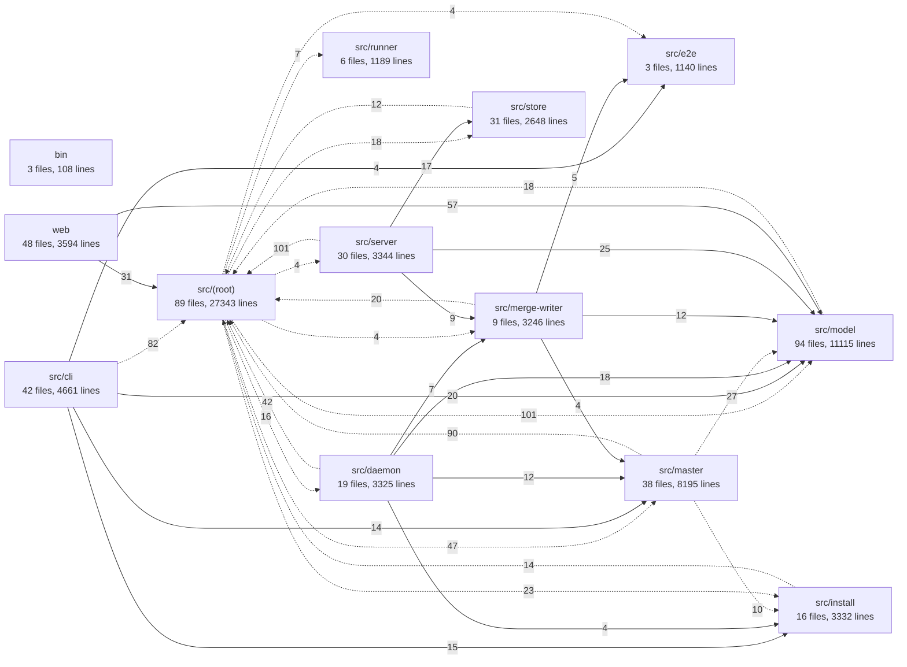

# Graphyard architecture review — 2026-10-31

Reviewed commit: `3cebd2c26cf01842ac824dd3eb2ba7194745aae3` (main tip, GY-2994). Draft in progress.

## Module dependencies as they are

```mermaid
flowchart LR
  bin["bin<br/>3 files, 108 lines"]
  src__root_["src/(root)<br/>89 files, 27343 lines"]
  src_cli["src/cli<br/>42 files, 4661 lines"]
  src_daemon["src/daemon<br/>19 files, 3325 lines"]
  src_e_e["src/e2e<br/>3 files, 1140 lines"]
  src_install["src/install<br/>16 files, 3332 lines"]
  src_master["src/master<br/>38 files, 8195 lines"]
  src_merge_writer["src/merge-writer<br/>9 files, 3246 lines"]
  src_model["src/model<br/>94 files, 11115 lines"]
  src_runner["src/runner<br/>6 files, 1189 lines"]
  src_server["src/server<br/>30 files, 3344 lines"]
  src_store["src/store<br/>31 files, 2648 lines"]
  web["web<br/>48 files, 3594 lines"]
  src__root_ -. 101 .-> src_model
  src__root_ -. 47 .-> src_master
  src__root_ -. 18 .-> src_store
  src_cli -. 82 .-> src__root_
  src_cli -- 20 --> src_model
  src_cli -- 14 --> src_master
  src_cli -- 15 --> src_install
  src_cli -- 4 --> src_e_e
  src_daemon -. 42 .-> src__root_
  src_daemon -- 12 --> src_master
  src_daemon -- 18 --> src_model
  src_daemon -- 4 --> src_install
  src_daemon -- 7 --> src_merge_writer
  src__root_ -. 4 .-> src_server
  src__root_ -. 4 .-> src_merge_writer
  src__root_ -. 7 .-> src_runner
  src_install -. 14 .-> src__root_
  src__root_ -. 16 .-> src_daemon
  src_master -. 27 .-> src_model
  src_master -. 90 .-> src__root_
  src_master -. 10 .-> src_install
  src_merge_writer -. 20 .-> src__root_
  src_merge_writer -- 12 --> src_model
  src_merge_writer -- 5 --> src_e_e
  src_merge_writer -- 4 --> src_master
  src_model -. 18 .-> src__root_
  src__root_ -. 23 .-> src_install
  src__root_ -. 4 .-> src_e_e
  src_server -. 101 .-> src__root_
  src_server -- 25 --> src_model
  src_server -- 17 --> src_store
  src_server -- 9 --> src_merge_writer
  src_store -. 12 .-> src__root_
  web -- 57 --> src_model
  web -- 31 --> src__root_
```
